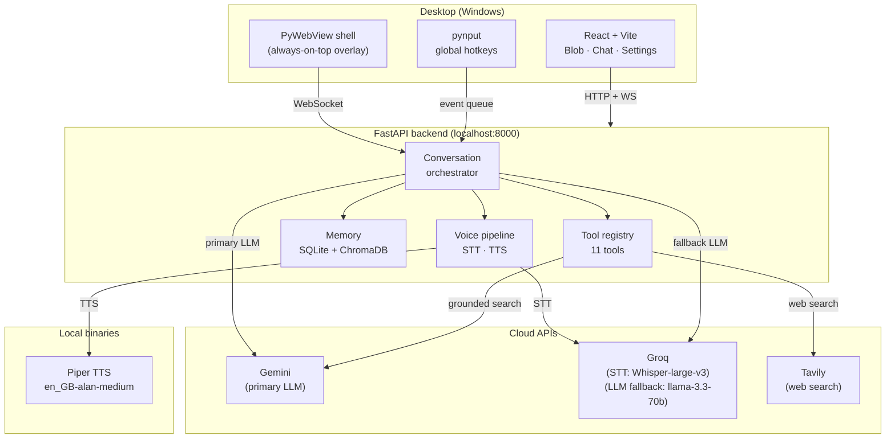

# research-jarvis

> Voice-first, project-aware AI research assistant that runs as a floating Windows overlay.

<!-- demo: added Day 30 -->

A daily-driver AI companion built for computational biology and research workflows. Ask questions, summarize papers, search the web, log project notes, launch apps, and set timers — all by voice. Runs as a transparent, always-on-top window on your desktop, powered by cloud APIs so it stays fast on low-spec hardware.

Built over 30 days with Python + React. Hybrid architecture: local for always-on tasks (hotkey listening, TTS, UI), cloud for heavy work (STT via Groq, LLM via Gemini, web search via Tavily).

---

## Features

| Capability | How to use |
|---|---|
| **Push-to-talk voice loop** | Hold `Alt+Space` → speak → release. Full STT → LLM → TTS pipeline. |
| **Project-scoped memory** | "Switch to alpha project", "Log this: JD15 binds at the ATP pocket", "What did I say about JD15?" |
| **PDF + arxiv summarization** | Drag a PDF onto the window, or say "Summarize arxiv 2301.00001". Structured output: claims, methods, results, limitations. |
| **Web search** | "What are the latest ABL1 inhibitor papers?" — Tavily API with LLM synthesis. |
| **App launcher** | "Open VS Code", "Open Chrome" — via `backend/tools/apps.yaml` whitelist. |
| **Timers** | "Set a timer for 25 minutes" — Windows toast notification when done. |
| **Mute toggle** | `Ctrl+Alt+J` — mutes the assistant; blob dims. |
| **System tray** | Right-click tray icon to show/hide the overlay or quit. |

---

## Architecture



**LLM chain:** Gemini primary (Flash / 2.5-Flash) → Groq (llama-3.3-70b-versatile) fallback on rate-limit or unavailability.

---

## Prerequisites

| Requirement | Version |
|---|---|
| Python | 3.12+ (developed and tested on 3.13.5) |
| Node | 20+ |
| OS | Windows 11 (PyWebView transparent windows; not tested on other OS) |
| Piper binary + voice | fetched automatically by the setup script |

---

## API Keys

All four are free-tier-friendly. Expected monthly cost at personal-use volume: **under $5**.

| Key | Where to get it | Free tier |
|---|---|---|
| `GEMINI_API_KEY` | [Google AI Studio](https://aistudio.google.com/app/apikey) | 1500 req/day (Flash) |
| `GROQ_API_KEY` | [console.groq.com](https://console.groq.com) | Generous — STT + LLM fallback |
| `TAVILY_API_KEY` | [tavily.com](https://tavily.com) | 1000 searches/month |
| `OPENAI_API_KEY` | [platform.openai.com](https://platform.openai.com/api-keys) | None — rarely used |

---

## Install

### One-shot setup (recommended)

```powershell
# From repo root, in a PowerShell terminal:
.\scripts\setup_windows.ps1
```

The script: checks Python ≥3.12 and Node ≥20, creates `.venv`, installs Python deps, runs `npm install` in `frontend/`, downloads the Piper binary + Alan voice model, and creates `.env` from the example if absent.

### Manual setup (if the script fails)

```powershell
# 1. Python venv + deps
python -m venv .venv
.\.venv\Scripts\Activate.ps1
pip install -r backend/requirements.txt

# 2. Frontend deps
cd frontend
npm install
cd ..

# 3. Piper TTS binary + voice model
python scripts/download_models.py

# 4. Secrets
copy .env.example .env
# Now open .env and fill in your 4 API keys
```

---

## First Run

Two processes must be running simultaneously. Open **two terminals** from the repo root.

**Terminal 1 — Vite dev server (frontend):**

```powershell
cd frontend
npm run dev
```

Wait for `Local: http://localhost:5173/` to appear.

**Terminal 2 — PyWebView shell + FastAPI backend:**

```powershell
.\.venv\Scripts\Activate.ps1
python -m backend.desktop
```

A transparent, always-on-top window appears in the bottom-right corner. The backend starts on `localhost:8000`. Boot log will show `tools registered: 11` and `tts warm-up complete`.

> **Note:** `.env` must be filled in before starting Terminal 2. Missing API keys cause clear error messages at the point they're needed, not at import time.

---

## Hotkeys

| Hotkey | Action |
|---|---|
| `Alt+Space` (hold) | Push-to-talk — hold while speaking, release to send |
| `Ctrl+Alt+J` | Mute toggle — blob dims, hotkeys still registered |

> **Alt+Space caveat:** Windows may briefly flash the system menu on some window configurations before the hotkey fires. This is cosmetic and doesn't affect functionality.

---

## Voice Commands

The assistant understands natural language. Some patterns it handles reliably:

```
"What are the latest papers on PROTAC degraders?"
"Summarize this paper"  (after dragging a PDF onto the window)
"Fetch arxiv 2301.00001"
"Switch to fitness project"
"Log this: bench press 3×8 at 70 kg"
"What did I say about JD15?"
"List my projects"
"Open VS Code"
"Open Chrome"
"Set a timer for 25 minutes"
"Set a Pomodoro"
```

---

## Project Memory

The assistant is project-scoped by default. On first boot, you're in the `general` project. Create and switch projects with voice:

```
"Switch to alpha project"
"Create a fitness project"
```

Everything logged with `log_to_project` and recalled with `recall_from_project` is scoped to the active project. ChromaDB provides semantic (vector) recall; SQLite stores the full history.

---

## Adding Apps to the Launcher

Edit [backend/tools/apps.yaml](backend/tools/apps.yaml). Each entry:

```yaml
- name: "VS Code"
  path: "C:\\Users\\<you>\\AppData\\Local\\Programs\\Microsoft VS Code\\Code.exe"
```

For Microsoft Store apps, use the `cmd` dispatch key:
```yaml
- name: "Spotify"
  cmd: "start shell:AppsFolder\\SpotifyAB.SpotifyMusic_zpdnekdrzrea0!Spotify"
```

---

## Troubleshooting

**`grounded_search` returns nothing / 429**
Gemini's grounded search (Google Search integration) is quota-limited on the free tier. The tool falls back gracefully — the LLM answers from its own knowledge, no crash. Expected behaviour on free accounts.

**Slow responses (occasionally 20–30s)**
Gemini API latency spikes under load; typical is 3–8s. The fallback to Groq kicks in on rate-limit. No code fix in v1 — documented for v2.

**PTT does nothing / no audio**
Check mic permissions: Windows Settings → Privacy & Security → Microphone → allow. Then check the selected input device in the Settings panel (gear icon in the overlay).

**Bluetooth mic flaky / chipmunk TTS**
Bluetooth headsets switch between headset mode (16 kHz mic) and headphones mode (48 kHz, no mic). Reconnect in headset mode. TTS chipmunk audio means the sample rate in settings doesn't match the `.onnx.json` for the active voice (default: 22050 Hz for Alan).

**Black flicker on first paint**
Normal for transparent PyWebView windows on Windows. Disappears after the first render.

**"Open \<app\>" says not in whitelist**
Add the app to `backend/tools/apps.yaml` — see [Adding Apps](#adding-apps-to-the-launcher).

**`ModuleNotFoundError` on first run**
Make sure you activated the venv (`.\.venv\Scripts\Activate.ps1`) before running `python -m backend.desktop`.

---

## Known Limitations

- **STT requires network** — uses Groq Whisper-large-v3; no local fallback in v1 (deliberate for i3 hardware).
- **`grounded_search` quota-limited** on free Gemini tier — soft-error path works; LLM answers from its own knowledge.
- **Gemini latency variable** — 3–8s typical; 20–30s possible under heavy API load. v2 timeout improvement planned.
- **Push-to-talk only** — wake word ("Hey Jarvis") is v2.
- **Windows only** — PyWebView transparent windows + pynput hotkeys are Windows-tested. macOS/Linux may work but are untested.
- **Single user** — no multi-user or remote-access design.

---

## Project Structure

```
research-jarvis/
├── backend/            # FastAPI app (main.py = entry point)
│   ├── api/            # Route handlers
│   ├── config/         # Pydantic Settings + logging
│   ├── database/       # SQLite schema + migrations
│   ├── desktop/        # PyWebView launcher + hotkeys + tray
│   ├── llm/            # Gemini/Groq providers + router
│   ├── memory/         # SQLite store + ChromaDB vector store
│   ├── models/         # Pydantic request/response types
│   ├── services/       # Conversation orchestrator + cost tracker
│   ├── tools/          # 11 LLM-callable tools (registry.py)
│   └── voice/          # STT (Groq) + TTS (Piper) + AudioRecorder
├── frontend/           # React 18 + Vite + TypeScript + Tailwind
│   └── src/
│       ├── blob/       # Animated SVG blob (6 states)
│       ├── components/ # ChatPanel · StatusBar · SettingsPanel
│       └── hooks/      # useWebSocket · useVoiceState
├── scripts/
│   ├── setup_windows.ps1       # One-shot environment setup
│   └── download_models.py      # Piper binary + voice model downloader
├── piper/              # Piper TTS binary (downloaded, gitignored)
├── piper_voices/       # ONNX voice models (downloaded, gitignored)
├── data/               # Runtime data — jarvis.db, chroma/, logs/ (gitignored)
└── docs/               # Build journal, plans, demo script
```

---

## Stack

| Layer | Choice |
|---|---|
| Backend | Python 3.13.5, FastAPI, Pydantic v2, SQLite, ChromaDB, loguru |
| Desktop shell | PyWebView + pynput |
| Frontend | React 19 + Vite + TypeScript + Tailwind + Framer Motion |
| STT | Groq Whisper-large-v3 (cloud) |
| TTS | Piper `en_GB-alan-medium` (local) |
| LLM primary | Gemini 2.0/2.5-Flash |
| LLM fallback | Groq llama-3.3-70b-versatile |
| Web search | Tavily API |
| PDF parsing | PyMuPDF |

---

## License

MIT — see [LICENSE](LICENSE).
